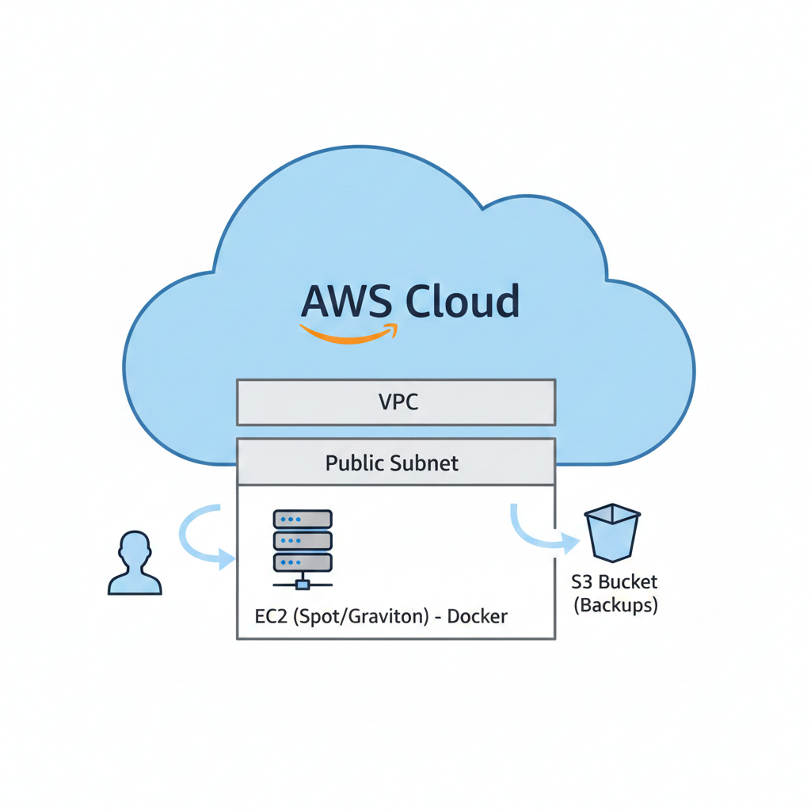

# AWS Bedrock Server - Cost Optimized & Automated Infrastructure


## 📋 Project Overview
This project deploys a fully automated, resilient, and cost-effective Minecraft Bedrock dedicated server on AWS using **Infrastructure as Code (IaC)**.

The architecture is designed to minimize costs using **Spot Instances** and **ARM64 (Graviton)** processors while ensuring data persistence through automated S3 backups and disaster recovery workflows.

## 🏗 Architecture
* **Compute:** AWS EC2 `t4g.small` (Graviton/ARM64) for superior price/performance.
* **Cost Strategy:** Spot Instances (saving ~70-90% vs On-Demand).
* **Storage:** EBS for OS + S3 Bucket for persistent World backups.
* **Security:** IAM Roles (Least Privilege), Security Groups restricted to necessary ports, and dynamic SSH key generation.
* **Automation:** `User Data` scripts handle Docker installation, world restoration, and scheduled backups (Cron).

## Arquitectura de la Solución

Aquí se detalla el flujo de infraestructura implementado en AWS:

<p align="center">
  
</p>

*Figura 1: Infraestructura desplegada utilizando VPC, Subnets Públicas y EC2 con copias a S3.*

## 🚀 Key Features (Why this architecture?)
1.  **Immutability:** The server can be destroyed and recreated at any time without data loss. The `user_data` script automatically fetches the latest backup from S3 upon boot.
2.  **FinOps/Cost Optimization:**
    * Leverages **ARM64** architecture which is more efficient for Bedrock server workloads.
    * Uses **Spot Instances**. If AWS reclaims the instance, the latest data is safe in S3.
3.  **Security First:** No AWS credentials are stored on the server. Access to S3 is granted via IAM Instance Profiles.

## 🛠 Prerequisites
* AWS CLI configured.
* Terraform installed.

## 💻 How to Deploy

1. **Clone the repository:**
   ```bash
   git clone [https://github.com/TU_USUARIO/aws-minecraft-bedrock.git](https://github.com/TU_USUARIO/aws-minecraft-bedrock.git)
   cd aws-minecraft-bedrock

2. **Initialize and Apply:**
	Bashterraform init
	terraform apply

Connect:
Terraform will output the Server IP.
Game Port: 19132 (UDP)SSH Access: ssh -i private_key.pem ec2-user@<OUTPUT_IP>💰 

Cost Estimation
Resource		Details			Estimated Cost 
(Monthly)EC2 (Spot)	t4g.small		~$2.50 USD
EBS Volume8GB 		gp3	~		$0.80 USD
S3			Storage & Requests	< $0.10 USD
Total**						~$3.40 USD / Month**


Note: This project is for educational purposes to demonstrate Cloud Architecture skills.
